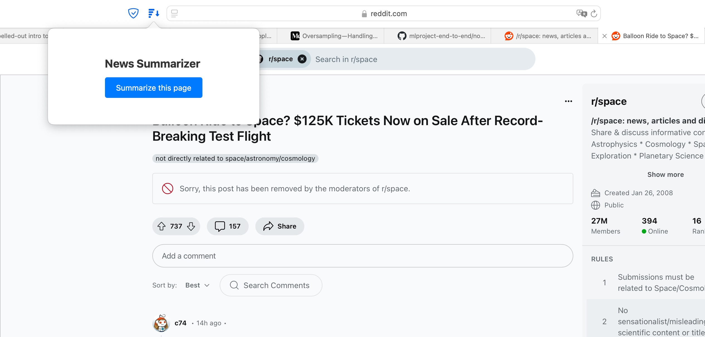
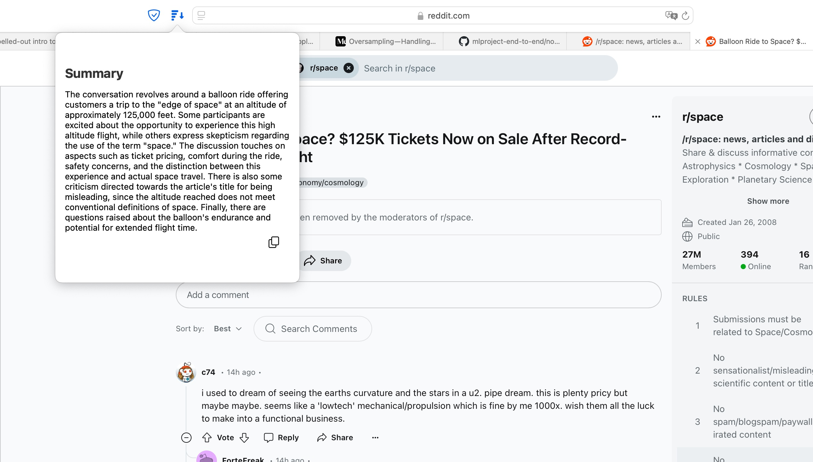

# news_summarizer

-------

Update: here's small safari extension: [SafariExt](https://github.com/acme-ag/news_summarizer/tree/54567812c4c5951888f1e32f77f7633f1b81cb42/SafariExt )
~~Still need local llm though~~ not anymore:

Upd 2:
Here one can choose to use either local LLM or ChatGPT API (faster but not for free): [Content_summarizer](https://github.com/acme-ag/news_summarizer/tree/54567812c4c5951888f1e32f77f7633f1b81cb42/Content_summarizer)

-------

A simple summarizer for news, blog posts, or articles. It retrieves a list of updated content from a news site, iterates through articles published within the past 7 days, and feeds each article sequentially to an LLM (in this case, Mistral 7B). The LLM generates summaries of the articles and returns a list of summaries along with their corresponding links.

The initial idea was to use a compact model for generating short text summaries for websites that you wouldn't usually visit every day or even every week. These are small sites where updates happen infrequently but can be important. For me, these are sites about rocket launches - you wouldn't check them every day, so it's easy to miss updates. And email subscriptions don't provide text summaries and eventually lead to too many emails, making them less significant.

The first variants were based on FLAN T5-small, but this is a really very small model with only 80 million parameters, so it had to be abandoned almost immediately. Next was T5 base with 250 million parameters. It provided brief summaries of acceptable quality, but due to a very modest context window, the model couldn't handle relatively large texts (through experimentation, I found that the limit is about 1600 characters) no matter how hard i ws trying to fine-tune it. Then there was Llama2, and I finally settled on Mistral 7B, especially since I found an easier - much easier - way to integrate models with Python via Ollama. For me, this was a new and interesting experience working with language models locally.

For scrapping -- instead of the BeautifulSoup package for data collection, I tried using Newspaper3k/4k, but in the news feed, it refused to collect publication dates from `newspaper.build()` without first downloading the actual articles. So i would still have to use BeautifulSoup or some other package for parsing.

Next maybe i'll put it on cron and make as a regular email or tg messageof wrap it into a web app with flask.

