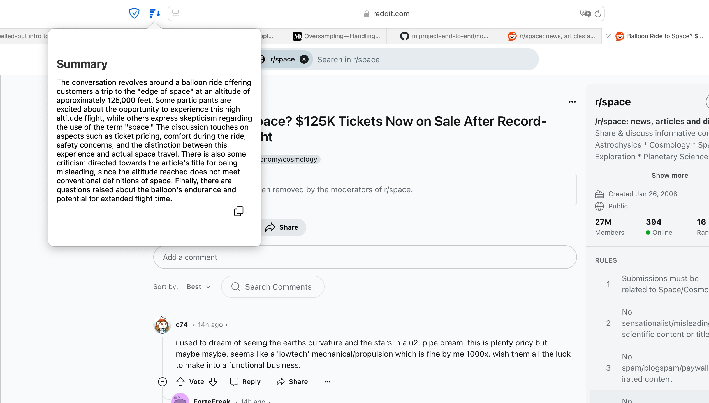

Update on summarizer.

just packed the logic into Safari extension. On click the extension passes the content to local LLM (Mistral 7b in my case) and retrieves summary of the page main content. Does not work on very old sites. In general -- works for me.

In the recent update, Apple released a summarizer embedded into Safari, but it doesn’t work on every site. For example, it doesn’t work with Reddit.

